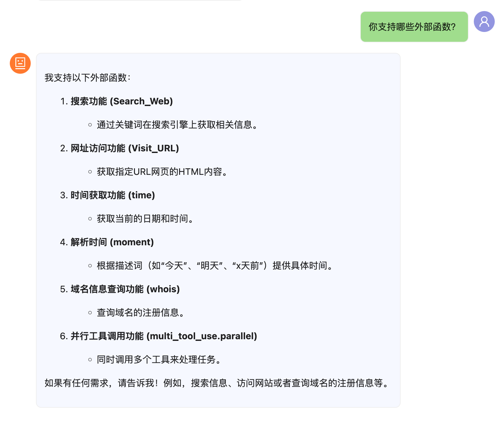

# EzService - 简易API服务框架

## 简介

EzService是一个超级超级超级轻量级API服务框架，基于Tornado构建，提供了便捷的API注册、调用和模块热加载功能。它允许开发者快速创建和部署API服务，支持命名空间隔离，自动生成API文档，并具备实时代码更新能力。

## PlayGround

[在这里实验:toai.chat](https://toai.chat)
> 新建对话后，在右边的配置选项中，有一个mcp服务器，就把这个地址填写进去...再在对话界面的右下角把“小机器人”点亮，就成功启动了toolcall模式。
> 比如你在本机启动了EzService，端口在8888 则直接填写 http://127.0.0.1:8888/jsonrpc 即可，
> 如果想用特别的namescape,可以使用 http://127.0.0.1:8888/jsonrpc?namespace=ns1,private,p00rn,*
> 此时，你可以询问:
> 
> 老实说，Authropic那个MCP的协议我看完以后标示，你们的协议是AI写的吧- -。。。。。这么一个一问一答的形式多好，非得整那出sse...

** 由于AI的协议关系，Fetch数据是走的这个服务器里的脚本，所以toai.chat(也就是我),无法获得你们的数据，请放心玩.... **


## 特性

- 简单的函数装饰器API注册机制
- 支持命名空间管理API函数
- 基于JSON-RPC的API调用
- 自动API文档生成
- 支持Python模块热加载
- 内置CORS支持
- 支持同步和异步函数

## 安装

安装所需依赖：

```bash
pip install tornado watchdog
```

## 基本用法

### 启动服务

```bash
python ez.py --port=8888 --directory=./modules --endpoint=http://localhost:8888/jsonrpc
```

### 命令行参数

- `-p`, `--port`: 设置服务器端口（默认: 8888）
- `-d`, `--directory`: 设置模块目录（默认: ./modules）
- `-e`, `--endpoint`: 设置API端点URL（默认: http://localhost:8888/jsonrpc）

## API注册和使用

### 创建API函数

在`modules`目录下创建Python模块，使用`@API.toolcall`装饰器注册函数：

```python
# 示例: /Users/kevin/Code/ezservice/modules/example.py
from ez import API

@API.toolcall(
    namespace='math',
    description='计算两数之和',
    kwargs={
        'a': {'description': '第一个数', 'required': True},
        'b': {'description': '第二个数', 'required': True}
    }
)
def add(a, b):
    """计算两数之和"""
    return int(a) + int(b)

@API.toolcall(
    description='打招呼',
    kwargs={
        'name': {'description': '你的名字', 'required': True}
    }
)
def hello(name):
    """打招呼函数"""
    return f"你好，{name}！"

# 支持异步函数
@API.toolcall(
    namespace='async',
    description='异步示例函数',
    kwargs={
        'delay': {'description': '延迟秒数', 'required': False}
    }
)
async def delayed_response(delay='1'):
    """异步延迟响应示例"""
    import asyncio
    await asyncio.sleep(float(delay))
    return f"延迟{delay}秒后的响应"
```

### 调用API

API可以通过JSON-RPC协议调用：

```javascript
// 使用fetch调用API
async function callApi(method, params) {
  const response = await fetch('http://localhost:8888/jsonrpc', {
    method: 'POST',
    headers: {
      'Content-Type': 'application/json'
    },
    body: JSON.stringify({
      jsonrpc: '2.0',
      id: 1,
      method: method,
      params: params
    })
  });
  return await response.json();
}

// 调用示例
callApi('add', {a: 5, b: 3}).then(data => console.log(data));  // {result: 8, id: 1, jsonrpc: "2.0"}
callApi('hello', {name: '世界'}).then(data => console.log(data));  // {result: "你好，世界！", id: 1, jsonrpc: "2.0"}
```

### 获取API列表

获取所有可用API列表：

```
GET http://localhost:8888/jsonrpc
```

获取指定命名空间的API：

```
GET http://localhost:8888/jsonrpc?namespace=math,async
```

## 命名空间管理

EzService支持通过命名空间管理API函数：

- 全局命名空间: 使用`namespace='*'`或不指定命名空间
- 自定义命名空间: 使用`namespace='custom_name'`
- 多命名空间: 使用逗号分隔，如`namespace='math,utils'`

## 项目结构

```
ezservice/
├── ez.py               # 核心框架文件
├── modules/            # API模块目录
│   ├── math.py         # 数学相关API
│   ├── utils.py        # 工具类API
│   └── ...
└── README.md           # 本文档
```

## 高级功能

### 热加载

EzService会自动监控模块目录的变化，当文件被修改或创建时，会自动重新加载模块，无需重启服务。

### API装饰器详解

`@API.toolcall`装饰器参数说明：

- `namespace`: API命名空间，默认为`*`（全局）
- `name`: API名称，默认为函数名
- `description`: API描述
- `kwargs`: 参数描述，格式为：
  ```python
  {
    '参数名': {
      'description': '参数描述',
      'required': True/False  # 是否必填
    }
  }
  ```

## 示例应用场景

### 构建AI工具函数

EzService格式符合OpenAI的函数调用规范，可直接用于构建AI工具：

```python
# 示例: /Users/kevin/Code/ezservice/modules/ai_tools.py
from ez import API

@API.toolcall(
    namespace='search',
    description='搜索数据库中的信息',
    kwargs={
        'query': {'description': '搜索关键词', 'required': True},
        'limit': {'description': '返回结果数量限制', 'required': False}
    }
)
def search_database(query, limit='10'):
    """模拟搜索数据库"""
    # 实际应用中这里会连接到真实数据库
    results = [f"搜索结果 {i} 关于: {query}" for i in range(int(limit))]
    return results
```

### 创建多个模块化API

```python
# 示例: /Users/kevin/Code/ezservice/modules/user_service.py
from ez import API

@API.toolcall(
    namespace='user',
    description='获取用户信息',
    kwargs={
        'user_id': {'description': '用户ID', 'required': True}
    }
)
def get_user(user_id):
    """获取用户信息"""
    # 模拟从数据库获取用户信息
    return {
        'id': user_id,
        'name': f'用户{user_id}',
        'email': f'user{user_id}@example.com'
    }

@API.toolcall(
    namespace='user',
    description='创建新用户',
    kwargs={
        'name': {'description': '用户名', 'required': True},
        'email': {'description': '电子邮件', 'required': True}
    }
)
def create_user(name, email):
    """创建新用户"""
    # 模拟创建用户
    user_id = hash(name + email) % 10000
    return {
        'success': True,
        'id': user_id,
        'name': name,
        'email': email
    }
```

## 贡献与反馈

欢迎提交问题和建议，或者通过PR贡献代码。

## 许可证

MIT
